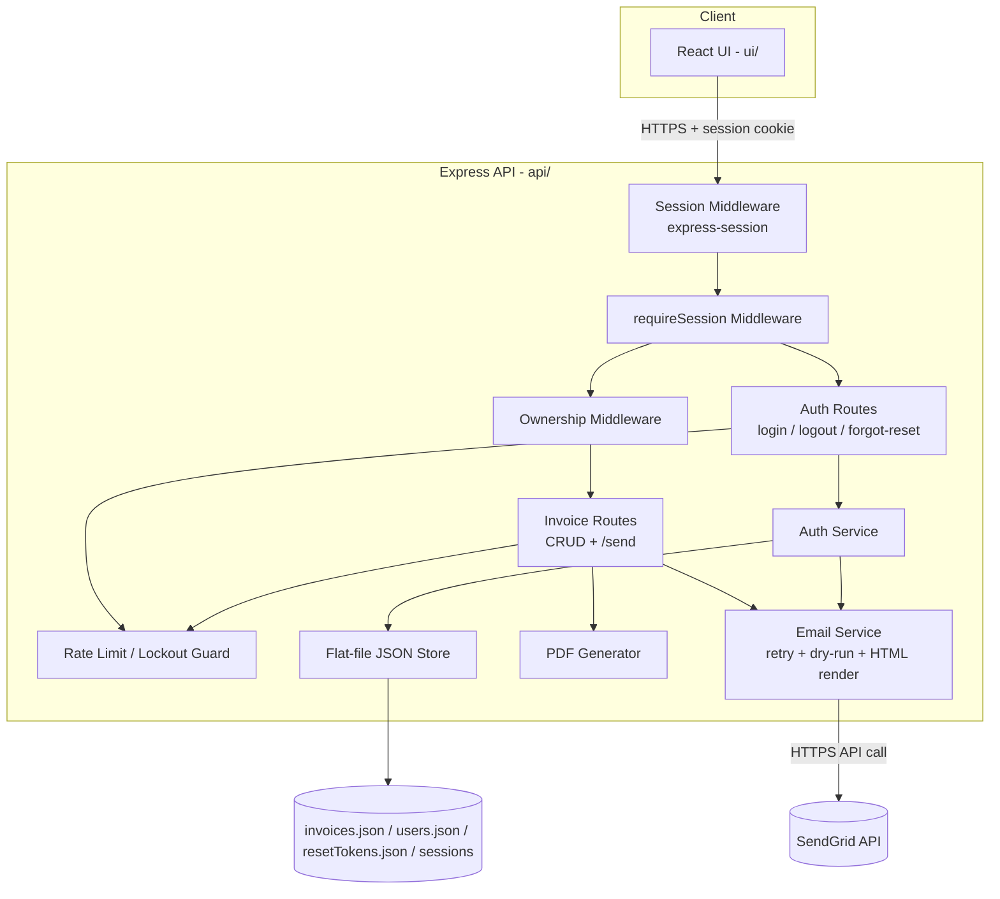

# Architecture

Source of truth: `.claude/skills/requirement/requirement.md` (EPMCDME-14102). This document designs the system that satisfies FR1–FR17 and NFR1–NFR8 from that file. No production code is included.

## 1. Architecture Overview

The existing app is a small, single-tenant Node/Express API (`api/`) backed by flat-file JSON (`api/data/invoices.json`) and a Vite/React SPA (`ui/`), with no authentication and no concept of separate users. The requirements add three things on top of this: (a) outbound email delivery of invoices via SendGrid, (b) a login-gated, multi-user, session-based authentication layer, and (c) per-user ownership of invoices.

The proposed architecture keeps the current **modular monolith** shape rather than introducing a database, message queue, or additional services:

- The API server remains a single Express process. New responsibilities (auth, email, ownership, rate limiting) are added as new middleware and route modules, following the existing `routes/` + `utils/` layering already used by `invoices.js`, `store.js`, and `totals.js`.
- Persistence remains **flat-file JSON**, extended with two new files (`users.json`, `resetTokens.json`) alongside the existing `invoices.json`, using the same `readX`/`writeX` pattern as `store.js`. This satisfies NFR4 (data survives restarts) without introducing a new datastore technology, which the requirements do not call for (expected usage is small-scale; see Risks in requirements.md).
- Session state is server-side (FR12), using `express-session` with a file-backed session store so sessions also survive a restart (NFR4), rather than an in-memory store that would lose sessions on redeploy.
- Email sending is isolated behind a single `EmailService` module wrapping the SendGrid SDK, so retry-with-backoff (FR4), dry-run mode (FR9), and the HTML template (FR7) are implemented once and reused by both invoice-send and password-reset email (FR14).
- Authorization is enforced as Express middleware applied to every invoice route: a `requireSession` gate (FR10) followed by an `enforceOwnership` check that scopes reads/writes to `req.session.userId` (FR16, FR17).

This satisfies the requirements without changing the fundamental deployment model: one Express process serving both the API and (in production) the built React assets, as today.

## 2. System Components

- **React UI (`ui/`)** — Adds a login screen, route guarding (redirect to login on 401), "Send"/"Resend" actions with delivery-status display, a confirmation dialog for editing/deleting a previously-sent invoice, and a "Forgot password" / "Reset password" flow. Reuses the existing invoice list/form components and `api.js` fetch wrapper.
- **Auth Routes (`api/routes/auth.js`, new)** — `POST /login`, `POST /logout`, `POST /forgot-password`, `POST /reset-password`. Delegates credential checking, hashing, and lockout logic to the Auth Service.
- **Auth Service (`api/utils/auth.js`, new)** — Verifies username/password against the user store using hashed comparison, tracks failed-attempt counts and lockout state (FR13), issues/destroys sessions, and generates/validates password-reset tokens (FR14).
- **Session Middleware (`express-session` + file-backed store)** — Establishes `req.session.userId` on login; the `requireSession` middleware rejects any request without a valid, non-expired session (FR10).
- **Ownership Middleware (`api/middleware/ownership.js`, new)** — Given `req.session.userId`, filters list results and rejects (403/404) any get/update/delete/send targeting an invoice owned by a different user (FR16, FR17).
- **Rate Limit / Lockout Guard (`api/utils/rateLimit.js`, new)** — In-process counters for (a) failed logins per username (FR13) and (b) sends per user per hour (FR8).
- **Invoice Routes (`api/routes/invoices.js`, modified)** — Existing CRUD routes gain session/ownership enforcement and the "already sent" confirmation guard (FR6). A new `POST /:id/send` route is added (FR1).
- **Email Service (`api/utils/email.js`, new)** — Wraps the SendGrid SDK: renders the HTML invoice email (FR7), performs retry-with-backoff bounded to the 15s budget (FR4, NFR3), supports a dry-run mode driven by an env var (FR9), and is reused for password-reset emails (FR14).
- **PDF Generator (`api/routes/invoices.js`'s pdfkit logic, refactored)** — The existing PDF-building code is extracted into a reusable function that can either stream to an HTTP response (existing `/:id/pdf` route, unchanged behavior) or produce a `Buffer` for email attachment, without duplicating the layout logic.
- **Persistence Layer (`api/utils/store.js`, extended + `userStore.js`, `resetTokenStore.js`, new)** — Flat-file JSON read/write for invoices (now including ownership and delivery fields), user accounts, and password-reset tokens, following the existing synchronous `fs.readFileSync`/`writeFileSync` pattern.
- **SendGrid (external)** — Third-party transactional email API used for both invoice delivery and password-reset emails.

## 3. Component Diagram

## 4. Data Flow

**4.1 Login**
1. UI submits username/password to `POST /auth/login`.
2. Auth Service checks the Rate Limit / Lockout Guard for the username; if locked, returns 403 with a lockout message (FR13).
3. Otherwise, Auth Service loads the user record from `users.json`, compares the hashed password.
4. On success: a session is created (`express-session` writes to the file-backed session store), a session cookie is set (httpOnly, ~30 day expiry — FR12, NFR6), and failed-attempt counters for that username are reset.
5. On failure: the failed-attempt counter increments; at 5 the account is locked for 15 minutes (FR13).

**4.2 Send Invoice**
1. UI calls `POST /invoices/:id/send` with the session cookie.
2. `requireSession` confirms the session; `OwnershipMW` confirms the invoice belongs to `req.session.userId` (403/404 otherwise).
3. The Rate Limit Guard checks the user's sends in the last hour; if ≥ 50, returns 429 without contacting SendGrid (FR8).
4. `to.email` is validated for presence and format; invalid input returns 400 before any SendGrid call (FR2).
5. The PDF Generator produces the invoice buffer; the Email Service renders the HTML body and calls SendGrid (or simulates it, in dry-run mode — FR9).
6. On failure, the Email Service retries with backoff, all within the 15s budget (FR4, NFR3).
7. The invoice's `deliveryStatus`, `lastSentAt`, `sendCount`, and `sendHistory` are updated and persisted via the Store, and the updated invoice is returned to the UI, whether the outcome was Sent or Failed.

**4.3 Editing/Deleting a Sent Invoice**
1. UI calls `PUT`/`DELETE /invoices/:id` as today.
2. `OwnershipMW` confirms the invoice belongs to the requester.
3. If the invoice's `deliveryStatus` is not "Not Sent" and the request does not carry an explicit confirmation flag, the API responds with a "confirmation required" result (see §6) instead of applying the change.
4. The UI shows a warning dialog; if the user confirms, the UI re-issues the request with the confirmation flag set, and the change proceeds (FR6).

**4.4 Password Reset**
1. UI calls `POST /auth/forgot-password` with a username/email.
2. Auth Service generates a single-use token, stores it (hashed) in `resetTokens.json` with a 1-hour expiry, and sends a reset link via the Email Service/SendGrid (FR14).
3. UI calls `POST /auth/reset-password` with the token and new password.
4. Auth Service validates the token exists, is unexpired, and unused; on success it updates the password hash in `users.json`, marks the token used, and rejects any later reuse or expired attempt with a clear error (NFR7).

**4.5 Listing/Viewing Invoices**
1. UI calls `GET /invoices` (or `/invoices/:id`) with the session cookie.
2. `OwnershipMW` filters results to `invoice.ownerId === req.session.userId` for the list, and returns 403/404 for a `:id` lookup owned by someone else (FR16, FR17).

## 5. Data Model

**User** (`users.json`)
- `id` (string, UUID)
- `username` (string, unique)
- `passwordHash` (string)
- `createdAt` (ISO timestamp)

**Invoice** (`invoices.json`) — existing fields (`id`, `invoiceNumber`, `date`, `dueDate`, `from`, `to`, `items`, `taxRate`, `notes`) plus:
- `ownerId` (string, FK → User.id) — set from the session on creation (FR16)
- `deliveryStatus` (enum: `Not Sent` | `Sent` | `Failed`, default `Not Sent`) (FR3)
- `lastSentAt` (ISO timestamp | null)
- `sendCount` (integer, default 0)
- `sendHistory` (array of `{ timestamp, outcome: Sent|Failed, error: string|null, triggeredBy: userId }`) (FR3)

State transitions for `deliveryStatus`: `Not Sent → Sent` (successful send/resend), `Not Sent|Sent|Failed → Failed` (send attempt exhausts retries), `Failed|Sent → Sent` (successful resend). Every transition appends one `sendHistory` entry; no transition removes history.

**PasswordResetToken** (`resetTokens.json`)
- `tokenHash` (string) — the token itself is only ever sent by email, never stored in plaintext
- `userId` (string, FK → User.id)
- `expiresAt` (ISO timestamp, created + 1 hour) (FR14, NFR7)
- `used` (boolean, default false)

**Session** (managed by `express-session` + file-backed store, not a hand-rolled entity)
- `sessionId`, `userId`, `createdAt`, `expiresAt` (~30 days) (FR12)

**In-memory counters** (not persisted; see §12)
- Login lockout: `username → { failedCount, lockedUntil }` (FR13)
- Send rate limit: `userId → [timestamps within the last hour]` (FR8)

## 6. API / Interface Changes

**New routes**
- `POST /api/auth/login` — `{ username, password }` → sets session cookie, returns the logged-in user's basic profile.
- `POST /api/auth/logout` — destroys the current session.
- `POST /api/auth/forgot-password` — `{ username }` → always returns a generic success response (to avoid leaking which usernames exist), triggers a reset email if the account exists.
- `POST /api/auth/reset-password` — `{ token, newPassword }` → validates and applies the new password.
- `POST /api/invoices/:id/send` — triggers send/resend; returns the updated invoice (with `totals`, as today) reflecting `deliveryStatus`.

**Modified routes** (all existing invoice routes: `GET /`, `GET /:id`, `POST /`, `PUT /:id`, `DELETE /:id`, `GET /:id/pdf`)
- All now require a valid session (401 otherwise) and are scoped to `req.session.userId` (403/404 for another user's invoice).
- `POST /` now sets `ownerId` from the session and initializes `deliveryStatus: 'Not Sent'`, `sendCount: 0`, `sendHistory: []`.
- `PUT /:id` and `DELETE /:id` gain the confirmation guard from §4.3: if the invoice was already sent and the request does not include an explicit `confirm: true` (body field, or equivalent), the API returns a distinct response (e.g. HTTP 409 with `{ error: 'confirmation_required', deliveryStatus }`) instead of a 200/204, so the UI can show the warning dialog before resubmitting with `confirm: true`. The exact transport for the confirmation flag is an implementation detail, not a new business rule.

## 7. Technology Choices

Kept from the existing project (no change):
- **Express** for routing/middleware (`api/`).
- **React + Vite** for the UI (`ui/`).
- **pdfkit** for PDF generation, refactored into a reusable function rather than replaced.
- **Flat-file JSON persistence**, extended with `users.json` and `resetTokens.json`, following `store.js`'s existing pattern.

New, minimal additions required by the requirements (none introduce a new datastore, service, or deployment target):
- **`express-session`** — server-side session cookies (FR12), the standard Express-ecosystem choice; avoids hand-rolling cookie/session handling.
- **A file-backed session store** (e.g. `session-file-store`) — so sessions survive a restart (NFR4) without adding Redis or a database, consistent with the project's flat-file philosophy.
- **`bcrypt`** — industry-standard password hashing (NFR5); the standard choice for Node.
- **`@sendgrid/mail`** — official SendGrid SDK, per the requirement's explicit choice of SendGrid as the email provider.
- **Hand-rolled email-format validation** (a small regex/utility function) rather than adding a validation library, to keep the dependency footprint minimal — sufficient for FR2's "reject malformed email" requirement.

No database, message queue, or container-orchestration technology is introduced; this story's scale (manually-provisioned accounts, flat-file invoices) does not warrant it, unlike the heavier Postgres/Redis/Kubernetes approach used for the separate EPMCDME-14099 payment-status story.

## 8. Error Handling

| Condition | Response | Notes |
|---|---|---|
| No/invalid/expired session | 401 | UI redirects to login (FR10) |
| Invoice belongs to another user | 403 or 404 | Treated identically to avoid confirming existence (FR17) |
| Login with wrong credentials | 401 | Increments failed-attempt counter (FR13) |
| Login while locked out | 403 | Includes remaining lockout time |
| Missing/malformed `to.email` on send | 400 | Rejected before any SendGrid call (FR2) |
| Send rate limit exceeded | 429 | `deliveryStatus` unchanged (FR8) |
| SendGrid unreachable/erroring, retries exhausted | 200, with `deliveryStatus: 'Failed'` and error detail in `sendHistory` | The HTTP call itself succeeded in processing the request; the *email* failed (FR4, FR6 of the original story) |
| Edit/delete of a previously-sent invoice without confirmation | 409 `confirmation_required` | UI shows warning, resubmits with `confirm: true` (FR6) |
| Expired or already-used reset token | 400 | Clear, generic error; no indication of which failure mode to reduce enumeration risk |
| Forgot-password for unknown username | 200 (generic success) | Prevents username enumeration; email simply isn't sent |

All error responses follow the existing `{ error: string }` envelope already used by `invoices.js`.

## 9. Security Considerations

- **Authentication**: username/password, hashed with bcrypt (NFR5); no self-service registration (FR15).
- **Authorization**: every invoice operation is scoped server-side to the session's `userId` (FR16, FR17) — the UI hiding another user's data is not sufficient on its own.
- **Session security**: httpOnly cookies, `secure` flag in production/HTTPS (NFR6); session secret via env var (NFR2).
- **Brute-force protection**: login lockout after 5 failed attempts / 15 minutes (FR13), enforced server-side (NFR8).
- **Password reset**: single-use, 1-hour-expiry tokens (NFR7); tokens stored hashed, never in plaintext; generic responses to avoid revealing valid usernames.
- **Input validation**: email format validated before any SendGrid call (FR2); invoice fields validated as today.
- **Secrets management**: `SENDGRID_API_KEY`, `SESSION_SECRET`, and the fixed sender address/name are supplied via environment variables only, never committed (NFR2), consistent with the project's existing env-var convention.
- **Sensitive data footprint**: client email addresses, full send history, and now password hashes and reset tokens are stored in flat files; access to the `api/data/` directory itself becomes a more sensitive boundary than before (see requirements.md Risks) — file permissions/deployment hardening are a deployment concern outside this story's code changes.
- **Rate limiting** on sends (FR8) also incidentally limits abuse of the SendGrid integration by a compromised or malicious account.

## 10. Performance and Scalability

- Email sending is asynchronous (`async`/`await` against the SendGrid SDK) so it does not block the Express event loop (NFR1).
- The 15-second send budget (NFR3) bounds retry-with-backoff; the Email Service should use a small, fixed number of retries with short delays (e.g. 2–3 attempts) rather than an open-ended backoff, to guarantee the budget is respected.
- Flat-file JSON read/write remains synchronous, matching the existing pattern; this is acceptable at the story's expected scale (a small number of manually-provisioned users) but has no file-locking, so concurrent writes (e.g. two simultaneous sends) can race — an accepted risk already called out in requirements.md.
- In-memory rate-limit/lockout counters (§5) only work correctly for a single Express process; if the API is ever scaled to multiple instances, these would need to move to a shared store (e.g. Redis) — out of scope for this story, noted as a constraint.
- No new requirement changes the invoice list's current unpaginated behavior; ownership filtering narrows the result set further, which if anything reduces per-request payload size compared to today's shared/global list.

## 11. Dependencies

**Internal**
- `api/routes/invoices.js`, `api/utils/store.js`, `api/utils/totals.js` — extended, not replaced.
- `ui/src/App.jsx`, `ui/src/api.js` — extended with login/session-aware fetch handling and send/confirmation UI.

**External**
- SendGrid (transactional email API) — invoice delivery and password-reset emails.
- `express-session` + file-backed session store — new npm dependencies.
- `bcrypt` — new npm dependency.
- `@sendgrid/mail` — new npm dependency.

**Cross-story**
- None on EPMCDME-14099 (payment-status tracking) — confirmed independent in requirements.md's Related Work section.

## 12. Assumptions and Open Questions

The following are not specified in `requirement.md` and are called out explicitly rather than invented as firm requirements:

- **Confirmation mechanic for editing/deleting a sent invoice**: requirements.md specifies the *behavior* (soft warning, overridable) but not the *transport*. §6 proposes a `confirm: true` flag; this is a design choice, not a business rule from the story.
- **Persistence of lockout/rate-limit counters across restarts**: NFR4 names delivery status, send history, account, and session data as persisted, but is silent on login-lockout and send-rate-limit counters. This design keeps them in-memory (reset on restart); if the user population grows or restarts are frequent, this may need revisiting.
- **Account provisioning mechanism**: FR15 says accounts are "manually provisioned" but does not specify the mechanism (a CLI script, direct edits to `users.json`, an admin-only API). Not designed here; assumed to be an operational/tooling concern outside this story's UI.
- **Password complexity rules**: not specified; assumed any non-empty password is acceptable at creation/reset time.
- **CSRF protection**: introducing cookie-based sessions typically raises the question of CSRF defenses for state-changing requests; requirements.md does not mention this. Flagged as an open question for the security review, not addressed by a specific FR/NFR here.
- **TLS/HTTPS termination**: NFR6 assumes cookies are "secure... when served over HTTPS" but deployment/TLS setup is not in scope of requirements.md and is not designed here.
- **UI visual design**: no wireframes exist; the UI changes described in §4 are behavioral, not visual, specifications.
- **Multi-device/session management**: no requirement addresses viewing or revoking other active sessions; logout is assumed to affect only the current session's cookie.
