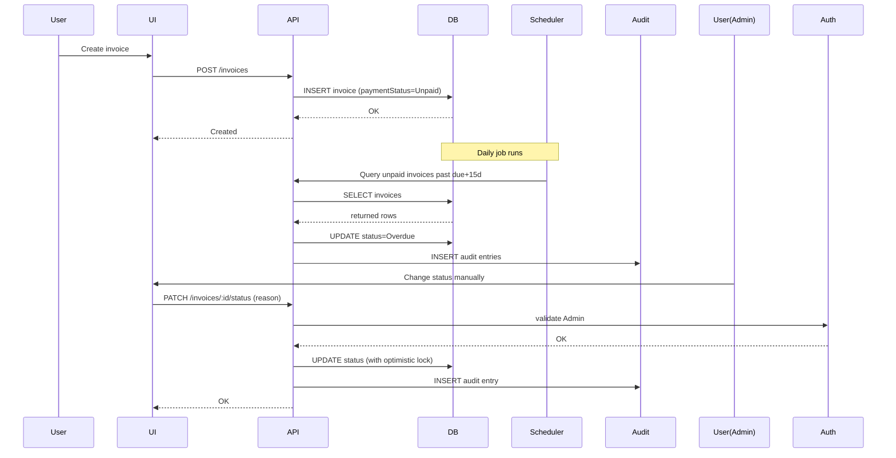

# Architecture: Invoice Payment-Status Enhancement

Generated from `.github/workflows/requirements/requirements.md` (2026-08-12)

**1) Recommendation (High-level)**

- Keep a modular-monolith approach within the existing `api/` service for rapid delivery, and extract the Audit Service later if scaling requires it.
- Use a relational database (Postgres) for invoices and audit logs to ensure ACID guarantees, retention policy support, and efficient indexing for audit queries.
- Implement a small background worker (Node.js with `node-cron` or a lightweight queue using Redis) to run the scheduled job marking invoices Overdue after the 15-day grace period.

**Why:** the repo already uses Node/Express for `api/` and React for `ui/`. A modular-monolith minimizes integration overhead while allowing later separation. Postgres provides strong consistency and easy retention/archival patterns.

**2) Key Components & Responsibilities**

- UI (`ui/` - React)
  - Display invoices, `paymentStatus`, and `Partial` flag.
  - Admin-only controls for manual status changes and audit viewing.
  - Trigger PDF export including `paymentStatus`.

- API Server (`api/` - Node/Express)
  - REST endpoints for invoice CRUD, status updates, PDF export, and audit queries.
  - Enforce server-side RBAC (Admin-only status changes & audit access).
  - Validate payloads and run optimistic locking (ETag/version) for status updates.

- PaymentStatus Module (internal to API)
  - Business rules: default `Unpaid`, `Partial` flag semantics, status transition validations.
  - Write audit entries on status changes.

- Audit Service / Audit Store
  - Separate schema/table `audit_log` in Postgres (or separate DB schema).
  - APIs for querying audit entries (Admin-only).
  - Retention/archival job to purge/archive entries older than 7 years.

- Scheduler / Worker
  - Daily job to find `Unpaid` invoices where `due_date + 15 days < now` and mark them `Overdue` (batching and pagination).
  - Produce audit entries for automatic transitions.

- Database (Postgres recommended)
  - `invoices` table: store invoice data and `payment_status` and `partial` fields.
  - `audit_log` table: store audit entries with indexes on `(invoice_id, timestamp)`.

- PDF/Storage
  - PDF generation component (existing) extended to include `paymentStatus`.
  - Optional object storage (S3) for archived PDFs.

- Auth/ACL
  - Centralized auth middleware (JWT/OAuth) validating roles; Admin role enforced for status-change and audit APIs.

**3) Component Diagram (Mermaid)**

```mermaid
flowchart LR
  UI[React UI]
  API[API Server (Node/Express)]
  PaymentModule[PaymentStatus Module]
  Scheduler[Scheduler / Worker]
  AuditService[Audit Store (Postgres)]
  DB[Primary DB (Postgres)]
  PDF[PDF Generator]
  Auth[Auth Service]

  UI -->|REST| API
  API -->|calls| PaymentModule
  API -->|reads/writes| DB
  PaymentModule -->|writes audit| AuditService
  Scheduler -->|batch update| PaymentModule
  Scheduler -->|writes audit| AuditService
  API -->|generate| PDF
  UI -->|auth| Auth
  API -->|validate token| Auth
  AuditService -->|retention job| Scheduler
```

**Detailed Component Diagrams**

Below are two more specific component diagrams: a logical component view, and a deployment view showing where components run.

Logical Component View

```mermaid
graph TD
  subgraph Client
    Browser[Browser / React UI]
  end

  subgraph Server[API Server - Node/Express]
    APIGW[API Gateway / Router]
    Auth[Auth Middleware (JWT / OIDC)]
    PaymentSvc[PaymentStatus Service]
    InvoiceSvc[Invoice Service]
    AuditWriter[Audit Writer]
    PDFSvc[PDF Generator]
  end

  subgraph Infra
    DB[(Postgres DB)]
    AuditDB[(Audit Table / Schema)]
    Cache[(Redis / Queue)]
    ObjStore[(S3 / Object Storage)]
  end

  subgraph Worker[Background Workers]
    Scheduler[Scheduler / Batch Worker]
    QueueWorker[Queue Worker (BullMQ)]
  end

  Browser -->|REST / GraphQL| APIGW
  APIGW --> Auth
  APIGW --> InvoiceSvc
  InvoiceSvc --> PaymentSvc
  PaymentSvc --> AuditWriter
  AuditWriter --> AuditDB
  InvoiceSvc --> DB
  InvoiceSvc --> PDFSvc
  PDFSvc --> ObjStore
  Scheduler --> PaymentSvc
  Scheduler --> AuditWriter
  QueueWorker --> AuditWriter
  QueueWorker --> DB
  Cache --> QueueWorker
```

Deployment View

```mermaid
graph LR
  subgraph K8sCluster[Kubernetes Cluster]
    FE[Frontend Pod(s): React static served via CDN or Nginx]
    API[API Pod(s): Node/Express]
    WORKER[Worker Pod(s): Scheduler & Queue Workers]
    PG[(Postgres StatefulSet)]
    REDIS[(Redis StatefulSet)]
  end

  S3[(S3 / Object Storage - external)]
  AUTH[(Corporate SSO / Auth Provider - external)]

  FE -->|HTTPS| API
  API -->|DB connection| PG
  API -->|cache/queue| REDIS
  WORKER -->|DB connection| PG
  WORKER -->|queue| REDIS
  API -->|upload/download| S3
  API -->|validate tokens| AUTH

  click PG "https://www.postgresql.org/" "Postgres" 
```

Each diagram focuses on a different aspect: the logical view clarifies responsibilities and interfaces between internal modules, while the deployment view shows runtime placement and external dependencies (Auth provider, Object Storage).

**4) Data Flow (Sequence for main flows)**n



**5) Data Model (suggested schema)**

- invoices
  - id (UUID PK)
  - invoice_number (string)
  - amount_cents (int)
  - due_date (timestamp)
  - payment_status (enum: Unpaid,Paid,Overdue,Partial,Canceled,Refunded)
  - partial (boolean)
  - created_at, updated_at
  - version (int) -- for optimistic locking

- audit_log
  - id (UUID PK)
  - invoice_id (FK -> invoices.id)
  - previous_status (string)
  - new_status (string)
  - admin_user_id (string)
  - reason (text, nullable)
  - created_at (timestamp)

Indexes: audit_log(invoice_id, created_at), invoices(due_date, payment_status)

**6) Technology Choices & Rationale**

- Backend: Node.js + Express (existing codebase) — minimal friction.
- DB: Postgres — ACID, relational integrity, indexing, retention/partitioning.
- Scheduler: `node-cron` for small deployments; for scale, use a worker queue (BullMQ with Redis) or Kubernetes CronJob.
- Auth: JWT tokens validated by API middleware; integrate with corporate SSO (OAuth/OIDC) if available.
- PDF: existing generator (keep), store in S3 or local storage depending on scale.
- Monitoring/Logging: Prometheus + Grafana for metrics; ELK or Loki for logs.

**7) Non-functional Considerations**

- Scalability: Batch the scheduled job (limit + offset or keyset pagination). Consider moving audit insertion to an async queue for very large batches.
- Retention: Implement partitioned `audit_log` by year or use a TTL/archive pipeline moving older rows to object storage.
- Security: server-side RBAC; encrypt backups; ensure admin actions are logged in audit.
- Availability: Deploy API behind load balancer; use read replicas for heavy read workloads.

**8) Migration & Backfill**

- Add `payment_status` column with default `Unpaid` and `partial` boolean (default false).
- Backfill existing rows: `UPDATE invoices SET payment_status='Unpaid' WHERE payment_status IS NULL;`
- Validate migration on a staging copy.

**9) Acceptance & Testing Strategy**

- Unit tests for payment-status state machine and API endpoints.
- Integration tests for scheduled job (using test DB, short grace period simulation).
- E2E test for admin manual change + audit entry creation.
- Load test for scheduled job with large invoice sets.

**10) Deployment / Rollout**

- Feature-flag the scheduled job and admin endpoints during rollout.
- Deploy to staging and run migration + backfill; confirm audit storage and PDF exports.
- Roll out to production; monitor metrics and audit-log size.

---

Files created: `.github/workflows/architecture/Architecture.md`

If you want, I can now:
- Commit and push the architecture document to `main`, or
- Generate a simple sequence/component PNG from the mermaid diagrams and add to the repo.

## Design Review Summary (findings & agreed decisions)

- Review date: 2026-08-12
- Reviewer: Senior Architect

Key Risks & Mitigations

- Audit storage growth: partition `audit_log` by year (or month for high-volume) and implement an archival/purge pipeline to satisfy the 7-year retention requirement. Consider moving >7y data to encrypted object storage (S3) with restricted access.
- Scheduler scalability and contention: implement keyset-pagination and small batch sizes for the daily job. Consider queueing updates (Redis/BullMQ) for controlled write throughput.
- Failure & retry behavior: make audit writes resilient with retries and idempotency keys; on repeated failures record incidents and alert.
- Concurrency: enforce optimistic locking (version column) and return HTTP 409 with retry guidance for conflicting updates.
- Security & compliance: require encryption-at-rest for audit data and server-side RBAC for audit access; log audit access events.

Agreed Design Decisions

- Use Postgres for primary data and partitioned `audit_log` table for audit entries.
- Store audit entries in a separate `audit_log` schema/table with indexes on `(invoice_id, created_at)`.
- Scheduler uses batched keyset-pagination; for scale, move to worker-queue model.
- Admin-only RBAC enforced server-side for manual status changes and audit viewing.
- Implement migration/backfill with batched updates and rollback support.

Action Items

1. Add DB partitioning and archival implementation notes and scripts to the implementation plan.
2. Add monitoring and alerting SLOs for scheduled jobs and audit pipeline failures.
3. Document migration runbook (batch sizes, staging verification, rollback steps).

See `.github/workflows/Design/design-review.md` for a complete review log and recommended mitigations.
